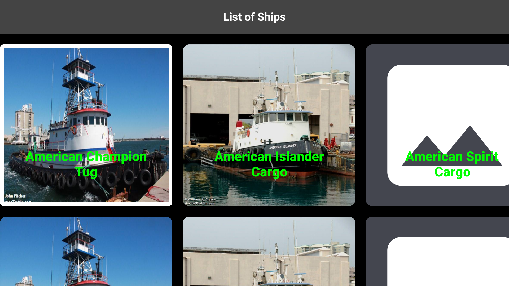

# Sample Android TV App

The project is a test implementation that uses Jetpack Compose for an Android TV OS app. It includes
API requests to fetch a dynamic list, integrates Hilt for Dependency Injection, and utilizes Room
Database for local data storage.

<a title="simulator_image"></a>

# The Project Contain the following technologies

[Android TV OS]()https://developer.android.com/tv is a version of Android designed for smart TVs,
providing an optimized interface for streaming and apps. <br />
The programming language is the [Kotlin](https://kotlinlang.org/docs/getting-started.html), it is a
modern, JVM-based programming language that is concise, safe, and interoperable with Java. <br />
[Kotlin Coroutines](https://kotlinlang.org/docs/coroutines-overview.html) is used for asynchronous
tasks. <br />
[Kotlin KTX](https://developer.android.com/kotlin/ktx) is a collection of Kotlin extensions that
offer more concise and expressive code for working with Android APIs and libraries.
The UI is build using [Jetpack Compose](https://developer.android.com/develop/ui/compose). <br />
[Retrofit](https://square.github.io/retrofit/) is responsible for making requests and retrieving
data from the remote server. ([Repository](https://github.com/square/retrofit)) <br />
[Hilt Dependencies Injection](https://developer.android.com/training/dependency-injection/hilt-android)
is an Android library that simplifies dependency injection by using annotations to automatically
manage and provide dependencies across components, built on top of
Dagger. ([Documentation](https://dagger.dev/hilt/)) <br />
[Room Database](https://developer.android.com/training/data-storage/room) is responsible for saving
the retrieved data from the remote server, querying data from the local database, and supporting
offline functionality.  <br />
[MVVM](https://developer.android.com/topic/architecture#recommended-app-arch) with repository is an
architecture where the Repository manages data sources (e.g., network, database), the ViewModel
processes the data for the UI, and the View displays the UI, ensuring a clear separation of
concerns. <br />
[KSP](https://developer.android.com/build/migrate-to-ksp) ("Kotlin Symbol Processing") is a tool for
efficient annotation processing in Kotlin, providing faster code generation and symbol manipulation
compared to KAPT. [Repository](https://github.com/google/ksp) <br />
[R8](https://developer.android.com/build/shrink-code) enabled, is a code shrinker and obfuscator for
Android that optimizes and reduces the size of APKs by removing unused code and resources, while
also obfuscating the remaining code to improve security. <br />

# Setup

## Setup in Manifest

```xml

<manifest>

    <uses-feature android:name="android.software.leanback" android:required="false" />

    <uses-feature android:name="android.hardware.touchscreen" android:required="false" />

    <application android:banner="@mipmap/ic_launcher">
        <!--other code here-->
        <activity>
            <!--other code here-->
            <intent-filter>
                <action android:name="android.intent.action.MAIN" />

                <category android:name="android.intent.category.LAUNCHER" />
                <category android:name="android.intent.category.LEANBACK_LAUNCHER" />
            </intent-filter>
        </activity>
        <!--other code here-->
    </application>
</manifest>
```

> [!IMPORTANT]  
> Check my article for the setup :point_right: [Android TV Application (Setup for Jetpack Compose and Flutter)- Medium](https://medium.com/@nicosnicolaou/android-tv-application-jetpack-compose-and-flutter-f4decfa765c6) :point_left: <br />

> [!IMPORTANT]
> Similar project with (Dart Language) :point_right: [SampleFlutterTVApp](https://github.com/NicosNicolaou16/SampleFlutterTVApp) :point_left: <br />

#Versioning

Target SDK version: 35 <br />
Minimum SDK version: 28 <br />
Kotlin version: 2.1.0 <br />
Gradle version: 8.7.3 <br /

# Feeds/Urls/End Point (parsing some data from response)

## (Links References for Ends Points)

https://github.com/r-spacex/SpaceX-API (GitHub) <br />
https://docs.spacexdata.com/?version=latest (Postman) <br />

# References/Tutorials Follow/For Manifest Setup

https://developer.android.com/training/tv/playback/compose <br />
https://developer.android.com/jetpack/compose/touch-input/focus/react-to-focus <br />
https://stackoverflow.com/questions/76281554/android-jetpack-compose-tv-focus-restoring <br />